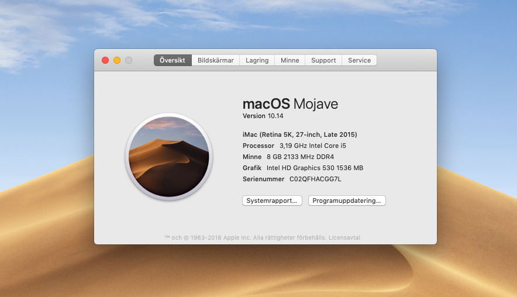

# Clover EFI for Dell computers with i5-6500 and Intel HD 530 graphics.

## What's this?

This is a clover efi for running macOS Mojave on Dell computers, will work on any dell computers running 6th generation Intel processors with integrated graphics. 
In order to get your graphics working you will need to update some EFI BIOS variables. You can find out how to do this [here](efitutorial.md).

## Information

### Credits
Apple, Dell.

### What doesn't work?

Functions that do not work are noted here:

- Airdrop, and any of the functions in macOS which needs a compatible WiFi/bluetooth card.